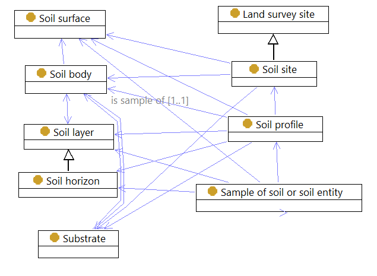

# ANSIS - Information Model and Schema

> These ANSIS documents provide an overview of the ANSIS Information Model and accompanying
> JSON Schema as summary tables. The RDF version of the [ANSIS Information Model](https://github.com/ANZSoilData/def-au-domain/blob/main/rdf/domain.ttl)
> is the authoritative source for definitions of soil concepts and properties. The ANSIS JSON schema
> and these documents are views of the RDF document for system implementation and human review
> respectively
>
> For technical notes on schema creation see the [design priciples](./design-principles.md) document.

## TL;DR
This folder contains interlinked documents presenting entities (classes) and properties in the
ANSIS Soil Domain Information Model as formatted tables.

[ansis-entities.md](./ansis-entities.md) is the best starting point for documentation of the model.
Links in this document will take the reader to related definitions or summaries of the relevant
ANSIS vocabularies.

The [ANSIS Soil Site](./ansis-entities.md#ansissoilsite) is the default entity queried and served by
ANSIS. All other soil data can be accessed through the site.

These documents current focus on mandatory and preferred properties required for the ANSIS Minimum
Viable Product. A complete model will be available after March 2023.

## Introduction
The information model is for the exchange of nationally consistent, harmonised data through the
Australian National Soil Information System (ANSIS). It adapts the standard Observations and
Measurements (O&M) approach to represent soil observation data. The O&M model is domain-independent.
A standard pattern is used to customize it for specific applications and domains. This approach
aligns with other initiatives in environment data that are based on the [SOSA](https://www.w3.org/TR/vocab-ssn/)
implementation of O&M, including the TERN, which is also being used as the basis for the
Biodiversity Data Repository from DCCEEW, and the Global Soil Information System.

## Summary Tables
ANSIS JSON Schema are distributed across a number of files. This is the help manage schema that are
based on different source information models (e.g. all SOSA derived sampling and observation schema
are defined in [sosa.json](../schema/domain/2023-06-30/sosa.json)). It also helps when loading
schema into code - one large schema is unmanageable. As such, each schema has its own documentation
file, prefixed by anisis- (e.g. [ansis-entities.md](./ansis-entities.md)).

The following table lists the schema documents. [ansis-entities.md](./ansis-entities.md) is the best
starting point for documentation of the model. Links in this document will take the reader to
related definitions or summaries of the relevant ANSIS vocabularies.

| Schema | Summary |
| ------ | ------- |
| [ANSIS Entities (ansis-entities.md)](./ansis-entities.md) | The core ANSIS soil information model. |
| [ANSIS Enumerations (ansis-enum.md)](./ansis-enum.md) | The core ANSIS soil vocabularies (each vocabulary is known as an *enumeration* in JSON Schema.) |
| [GeoSPARQL (ansis-geo.md)](./ansis-geo.md) | Geometry properties as defined by the *OGC GeoSPARQL* model. |
| [PROV and PROJ Ontology (ansis-prov.md)](./ansis-prov.md) | Useful classes from the *PROV (provenance) Ontology*. These help describe activities and who undertakes them. |
| [QUDT (ansis-qudt.md)](./ansis-qudt.md) | Classes for quantity values and their units of measure. From the *Quantity, Unit, Dimension and Type Ontology*. |
| [SKOS (ansis-skos.md)](./ansis-skos.md) | Classes from the *Simple Knowledge Organisation System*. Used to describe vocabulary entries (labels and definitions). |
| [SOSA (ansis-sosa.md)](./ansis-sosa.md) | Classes from the *Sensor, Observation, Sample, and Actuator Ontology*. The basis for descriptions of samples, sampling activities, site visits, and observations and laboratory measurements. | 
| [ANSIS Base Properties (ansis-base.md)](./ansis-base.md) | Reusable properties for identifiers, labels, links and so on. |

## ANSIS Information Model for Soil - Brief Summary
> The full description of the ANSIS Information is published here:
> [link to ANSIS Information Model v1.5]().

The initial model for ANSIS is primarily an interpretation of The Australian Soil and Land Survey
(ASLS) handbook representing soils as understood by the Australian soil domain community, but
adapted for ANSIS. As such it focusses on the description of Soil Profiles at Soil Sites. These are
the fundamental data to be served by ANSIS.

*Figure 1. Summary diagram showing the main entity types-(classes) for soil observations.*

ANSIS will provide data for Soil and Land Survey Sites and the Soil Profiles described at those
sites. Within each site will be nested data, or links to other data, describing the soil, horizons,
constituents of horizons (e.g. mottles), samples and laboratory observations.